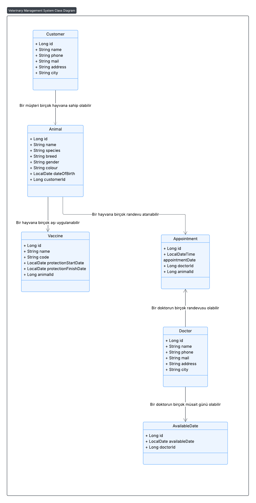

# 🐾 Veterinary Management System

A RESTful API project built with **Spring Boot**, **Java 21**, and **PostgreSQL**,  
designed to manage all operational processes of a **veterinary clinic** — including doctor scheduling, animal registration, vaccination tracking, and appointment management.

This project was developed as a **graduation project** for the Patika+ Back-End Bootcamp.

---

## 🚀 Technologies

- Java 21
- Spring Boot 3.3+
- Spring Web
- Spring Data JPA
- PostgreSQL 16+
- Lombok
- Maven

---

## 📂 Project Structure

```

VeterinaryManagementSystem/
│
├── src/
│   ├── main/
│   │   ├── java/com/tolgademir/veterinarymanagementsystem/
│   │   │   ├── controller/        # REST API endpoints
│   │   │   ├── service/           # Business logic layer
│   │   │   ├── repository/        # Data access layer (DAO)
│   │   │   ├── model/             # Entities (Animal, Customer, Doctor, etc.)
│   │   │   └── exception/         # Custom exceptions
│   │   └── resources/
│   │       ├── application.properties
│   │       ├── schema.sql         # Database structure
│   │       ├── seed_data.sql      # Initial test data
│   │       └── postman/           # Postman collection (API tests)
│   └── test/                      # Unit tests (optional)
│
├── pom.xml
└── README.md

```

---

## 🧩 Entities & Relationships

| Entity | Description | Key Relationships |
|---------|--------------|------------------|
| **Customer** | Pet owner information | One-to-Many → Animals |
| **Animal** | Pet details | Many-to-One → Customer |
| **Doctor** | Veterinarian info | One-to-Many → AvailableDates, Appointments |
| **AvailableDate** | Doctor’s available working dates | Many-to-One → Doctor |
| **Appointment** | Pet appointments with doctors | Many-to-One → Doctor, Animal |
| **Vaccine** | Pet vaccination info | Many-to-One → Animal |

---

## 🧱 Database Schema

📄 **File:** [`src/main/resources/schema.sql`](./src/main/resources/schema.sql)

```sql
CREATE TABLE customers ();
CREATE TABLE animals ();
CREATE TABLE doctors ();
CREATE TABLE available_dates ();
CREATE TABLE appointments ();
CREATE TABLE vaccines ();

```

---

## 🌱 Seed Data

**File:** [`src/main/resources/seed_data.sql`](.src/main/resources/seed_data.sql)

#### The file includes at least 5 sample records for each table:

- 5 Customers

- 5 Animals

- 5 Doctors

- 5 Available Dates

- 5 Appointments

- 5 Vaccines

---

## 🔁 Database Reset Script

If you want to clear all data and start fresh before re-importing **seed_data.sql:**

```sql
TRUNCATE TABLE
    appointments,
    available_dates,
    vaccines,
    animals,
    doctors,
    customers
RESTART IDENTITY CASCADE;
```

---

## 📫 API Endpoints (Overview)

| Module            | Method | Endpoint                        | Description                     |
| ----------------- | ------ | ------------------------------- | ------------------------------- |
| **Customer**      | POST   | `/api/customers`                | Create customer                 |
|                   | GET    | `/api/customers`                | Get all customers               |
|                   | GET    | `/api/customers/{id}`           | Get by ID                       |
|                   | PUT    | `/api/customers/{id}`           | Update customer                 |
|                   | DELETE | `/api/customers/{id}`           | Delete customer                 |
| **Animal**        | POST   | `/api/animals`                  | Create animal                   |
|                   | GET    | `/api/animals`                  | Get all animals                 |
|                   | GET    | `/api/animals/name/{name}`      | Filter by name                  |
|                   | GET    | `/api/animals/customer/{id}`    | Filter by owner                 |
| **Doctor**        | POST   | `/api/doctors`                  | Add doctor                      |
|                   | GET    | `/api/doctors`                  | List doctors                    |
| **AvailableDate** | POST   | `/api/available-dates`          | Add available day               |
| **Appointment**   | POST   | `/api/appointments`             | Create appointment              |
|                   | GET    | `/api/appointments`             | Get all appointments            |
|                   | GET    | `/api/appointments/doctor/{id}` | Filter by doctor & date range   |
|                   | GET    | `/api/appointments/animal/{id}` | Filter by animal & date range   |
| **Vaccine**       | POST   | `/api/vaccines`                 | Add vaccine                     |
|                   | GET    | `/api/vaccines`                 | List all vaccines               |
|                   | GET    | `/api/vaccines/animal/{id}`     | List by animal                  |
|                   | GET    | `/api/vaccines/protection`      | Filter by protection date range |

---

## ⚙️ Business Rules

✅ Randevu Kontrolü

Randevu oluşturulurken,

Doktorun o tarihte müsait günü yoksa hata verir:

“Doktor bu tarihte çalışmamaktadır!”

Doktorun aynı saat için başka randevusu varsa hata verir:

“Girilen saatte başka bir randevu mevcuttur!”

✅ Aşı Koruyuculuk Kontrolü

Aynı hayvan + aynı aşı kodu + bitmemiş koruyuculuk varsa yeni kayıt engellenir.

✅ Cascade Silme Kuralı

Customer silindiğinde → tüm hayvanları, aşıları ve randevuları da otomatik silinir.

✅ Custom Exceptions

**RecordNotFoundException**, **ConflictException**, **DoctorNotAvailableException**, **AppointmentConflictException**

---

## 🧾 Postman Collection

All endpoints are documented and tested in Postman.
Collection file:
VeterinaryManagementSystem.postman_collection.json

Import this file into Postman to test all CRUD operations directly.

---

## ▶️ Run Instructions

1️⃣ Create Database

```sql
CREATE DATABASE veterinary_db;
```

2️⃣ Configure Connection
```
Update your application.properties:

spring.datasource.url=jdbc:postgresql://localhost:5432/veterinary_db
spring.datasource.username=postgres
spring.datasource.password=your_password
```
3️⃣ Run Schema & Seed
```sql
\i 'src/main/resources/schema.sql';
\i 'src/main/resources/seed_data.sql';
```
4️⃣ Start Spring Boot App
```
In IntelliJ:

Run → VeterinaryManagementSystemApplication
```
Server starts at:
👉 http://localhost:8080

---

## 🧠 UML Diagram


---

## 🧑‍💻 Author
**Tolga Demir**

```Back-End Developer | Java | Spring Boot | PostgreSQL```
- [GitHub](https://github.com/tolgademir-co)
- [LinkedIn](https://www.linkedin.com/in/tolgademir-co/)

---

## 📜 License

This project is licensed under the MIT License.
You are free to use, modify, and distribute it with attribution.